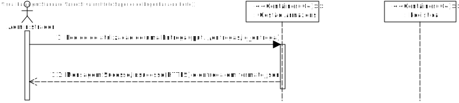
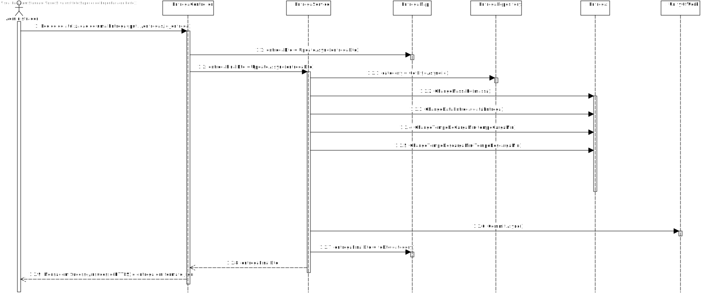

# US003 - Editar um armazém

# 1. Análise

#### Requisitos funcionais
O sistema deve permitir editar uma entrega.

#### Regras de negócio
* A entrega que o administrador pretende editar tem de estar pré-definido. 
* Este pedido é feito por um serviço REST (não há interface com o utilizador).
* O pedido é feito ao módulo de Gestão de Armazém. 

#### Partes interessadas
A parte interessada nesta US é o administrador.

#### Pré-condições
* A entrega tem de existir no sistema.

#### Pós-condições
* Após a atualização feita na entrega, o sistema tem de persistir as atualizações na Base de dados.

### Nível 1 - Vista Processo:

# 2. Design

##  Realização da Funcionalidade
### Para editar um armazém especifico: 

#### Classes de dominio: 
* Entrega; 
* EntregaDTO;

#### Classes de aplicação:  
* EntregaController; 

#### Classes repositorio: 
* EntregaRepository;

### Nivel2 Vista Processo:

##  Padrões Aplicados

* Padrão GRASP (General Responsibility Assignment Software Patterns), utilizado na criação de controladores para atribui a responsabilidade de manipular eventos do sistema para uma classe que não seja de interface do usuário (UI) e, também, nesta us não será tratada da interface com o utilizador;

* Padrão CRUD (acrónimo do inglês Create, Read, Update and Delete) são as quatro operações básicas utilizadas em bases de dados relacionais fornecidas aos utilizadores do sistema, assim como em muitos serviços HTTP.

* Padrão SOLID (acrónimo do inglês Single Responsibility Principle, Open-Closed Principle, Liskov Substitution Principle, Interface Segregation Principle, Dependency Inversion Principle), princípios que se aplicam a qualquer design orientado a objetos, são a filosofia central para metodologias como desenvolvimento software adaptável.

* Padrão DTO (Data Transfer Objects), na criação de estruturas de dados simples que não contêm lógica de negócios.

* Padrão Repository, para fornecendo melhor capacidade de manutenção e desacoplando a infraestrutura ou tecnologia usada para aceder a base de dados o a camada de modelo de domínio.

# 3. Implementação

## Nivel3 Vista Processo:

# Observações

No futuro pode ser necessário implementar interface gráfica.