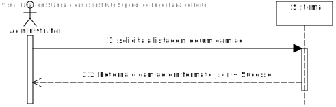
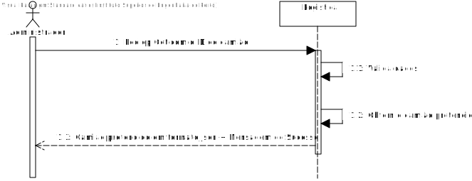
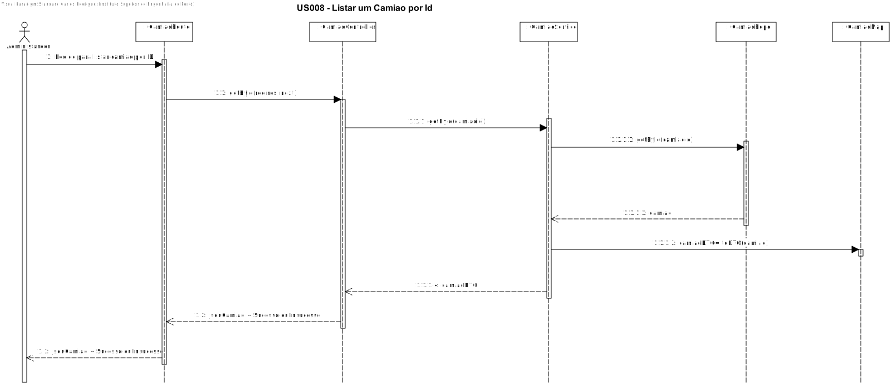

# US005 - O sistema deve permitir listar um camiao.

# 1. Análise

#### Requisitos funcionais

O sistema deve permitir ao administrador listar um camiao através de pedidos REST.

#### Regras de negócio

-

#### Partes interessadas

A parte interessada nesta US é o administrador.

#### Pré-condições

* A entrega tem de existir no sistema.

#### Pós-condições

* Nenhuma.

#### Fluxo

O administrador deseja listar um camiao no sistema através de um GET. O sistema procura a entrega na base de dados e mostra-a.

## Nível 1 - Vista Processo:

# 2. Design

##  Realização da Funcionalidade
### Para listar uma entrega:

#### Classes de domínio:
* Camiao;
* CamiaoDTO

#### Classes de aplicação:  
* CamiaoController;
* CamiaoService;

#### Classes repositorio:
* CamiaoRepository;

## Nível 2 - Vista Processo:

##  Padrões Aplicados

* Padrão GRASP (General Responsibility Assignment Software Patterns), utilizado na criação de controladores para atribuir a responsabilidade de manipular eventos do sistema para uma classe que não seja de interface do usuário (UI);

* Padrão CRUD (acrónimo do inglês Create, Read, Update and Delete) são as quatro operações básicas utilizadas em bases de dados relacionais fornecidas aos utilizadores do sistema, assim como em muitos serviços HTTP.

* Padrão SOLID (acrónimo do inglês Single Responsibility Principle, Open-Closed Principle, Liskov Substitution Principle, Interface Segregation Principle, Dependency Inversion Principle), princípios que se aplicam a qualquer design orientado a objetos, são a filosofia central para metodologias como desenvolvimento software adaptável.

* Padrão DTO (Data Transfer Objects), na criação de estruturas de dados simples que não contêm lógica de negócios.

* Padrão Mapper (Data Transfer Object Design Pattern), é um dos padrões de arquitetura de aplicativos corporativos que exige o uso de objetos que agregam e encapsulam dados para transferência. Um Objeto de Transferência de Dados é, essencialmente, como uma estrutura de dados. Ele não deve conter nenhuma lógica de negócios, mas deve conter mecanismos de serialização e desserialização.

* Padrão Repository, para fornecer melhor capacidade de manutenção e desacoplando à infraestrutura ou tecnologia usada para aceder à base de dados ou à camada de modelo de domínio.

# Implementação

# Observações
No futuro vai haver uma funcionalidade que vai utilizar esta, através de uma User Interface.