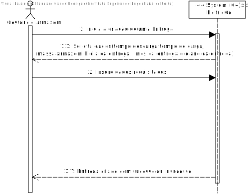
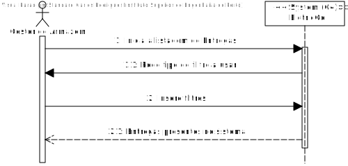
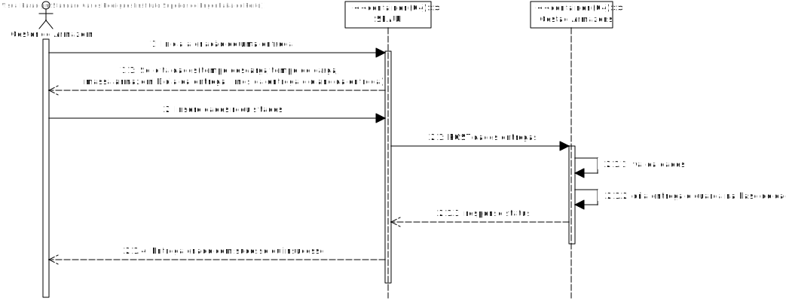
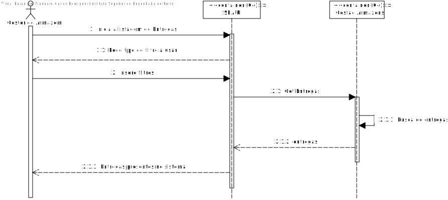
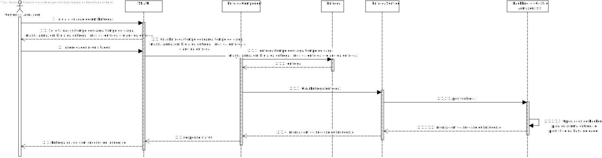
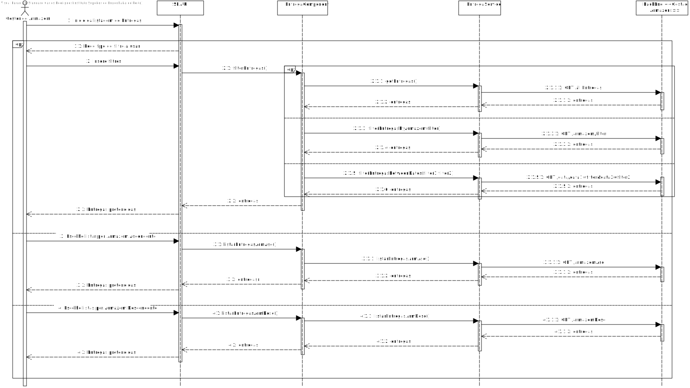

# US015 - Como gestor de frota pretendo criar e listar entregas

# 1. Análise

#### Requisitos funcionais

O sistema deve permitir ao gestor de frota criar e listar entregas.

#### Regras de negócio

* O gestor de frota pretende criar e listar entregas.
* Este pedido é feito por interface com o utilizador (Módulo SPA).
* O pedido é feito ao módulo SPA que comunica com o módulo de Gestao Armazens .

#### Partes interessadas

A parte interessada nesta US é o gestor de frota.

#### Pré-condições

* O Armazem de entrega deve existir previamente.

#### Pós-condições

* Após a criar da entrega, o sistema tem de persistir a criação na Base de dados.

## Nível 1 - Vista Processo:

# 2. Design

## Nível 2 - Vista Processo:

##  Padrões Aplicados

* Padrão GRASP (General Responsibility Assignment Software Patterns), utilizado na criação de controladores para atribuir a responsabilidade de manipular eventos do sistema para uma classe que não seja de interface do usuário (UI);

* Padrão CRUD (acrónimo do inglês Create, Read, Update and Delete) são as quatro operações básicas utilizadas em bases de dados relacionais fornecidas aos utilizadores do sistema, assim como em muitos serviços HTTP.

* Padrão SOLID (acrónimo do inglês Single Responsibility Principle, Open-Closed Principle, Liskov Substitution Principle, Interface Segregation Principle, Dependency Inversion Principle), princípios que se aplicam a qualquer design orientado a objetos, são a filosofia central para metodologias como desenvolvimento software adaptável.

* Padrão DTO (Data Transfer Objects), na criação de estruturas de dados simples que não contêm lógica de negócios.

# Implementação

# Observações