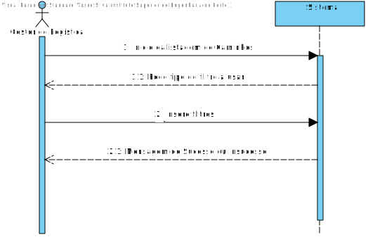
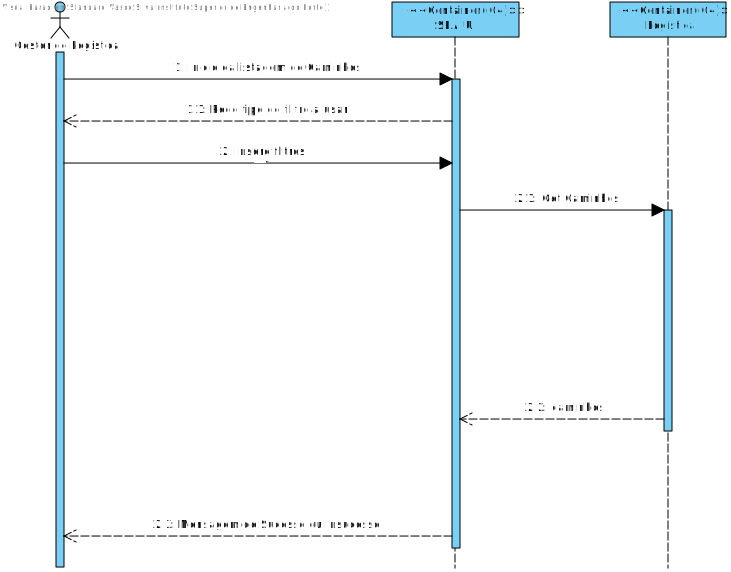
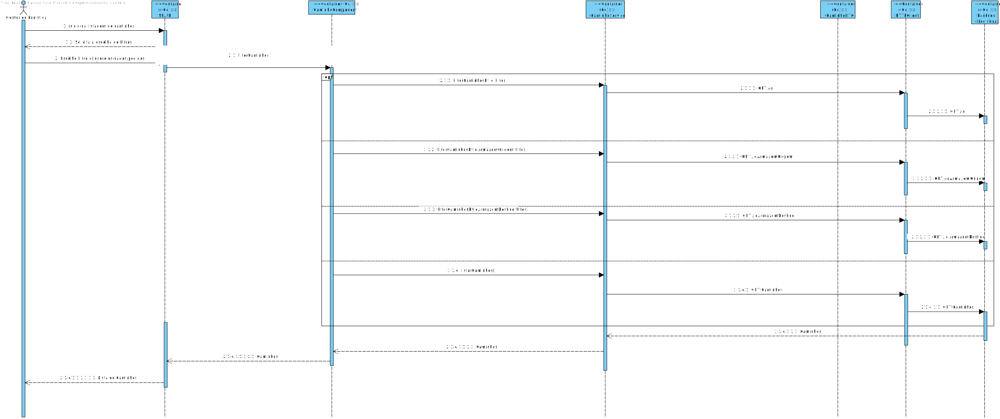

# UC 10 - O sistema deve permitir criar um caminho.

# 1. Análise

#### Requisitos funcionais

O sistema deve permitir listar um caminho(SPA).

#### Regras de negócio

* A distância entre armazéns é expressa em Km;
* O tempo de deslocação é expresso em minutos;
* A energia necessária para realizar um caminho é representada em KWh;
* O id do Armazém de Origem e Destino devem ser ids existentes.

#### Partes interessadas

As partes interessadas neste UC é o Gestor de Logistica.

#### Pré-condições

* Nenhumas.

#### Pós-condições

* O sistema tem de ter as capacidades de persistir o pedido de ligação.

#### Fluxo

O Gestor de logistica deseja criar um caminho no sistema através de uma SPA. 
O sistema recebe o pedido do cliente e procede à sua criação e persistência na base de dados.

## NV1 VP UC10:

#  Design

##  Realização da Funcionalidade
### Para pesquisar e enviar um pedido de ligação:

### Backend
#### Classes de dominio: 
* Caminho; 
* CaminhoDistanciaArmazem;
* CaminhoEnergiaNecessariaKWh;
* CaminhoTempoDeslocacaoMin;
* CaminhoId;
 
#### Classes de aplicação:  
* CaminhoController;
* CaminhoService;

#### Classes repositorio: 
* CaminhoRepository;
* ArmazemRepository.

### FrontEnd
#### Classes de dominio: 
* Caminho; 
 
#### Classes de aplicação:  
* CaminhoComponent;
* CaminhoService;

#### View
* CaminhoComponent.html

#### Style

* CaminhoComponent.css

## NV2 VP UC10:

##  Padrões Aplicados

* Padrão GRASP (General Responsibility Assignment Software Patterns), utilizado na criação de controladores para atribui a responsabilidade de manipular eventos do sistema para uma classe que não seja de interface do usuário (UI);

* Padrão CRUD (acrónimo do inglês Create, Read, Update and Delete) são as quatro operações básicas utilizadas em bases de dados relacionais fornecidas aos utilizadores do sistema, assim como em muitos serviços HTTP.

* Padrão SOLID (acrónimo do inglês Single Responsibility Principle, Open-Closed Principle, Liskov Substitution Principle, Interface Segregation Principle, Dependency Inversion Principle), princípios que se aplicam a qualquer design orientado a objetos, são a filosofia central para metodologias como desenvolvimento software adaptável.

* Padrão DTO (Data Transfer Objects), na criação de estruturas de dados simples que não contêm lógica de negócios.

* Padrão Mapper (Data Transfer Object Design Pattern), é um dos padrões de arquitetura de aplicativos corporativos que exige o uso de objetos que agregam e encapsulam dados para transferência. Um Objeto de Transferência de Dados é, essencialmente, como uma estrutura de dados. Ele não deve conter nenhuma lógica de negócios, mas deve conter mecanismos de serialização e desserialização.

* Padrão Repository, para fornecendo melhor capacidade de manutenção e desacoplando a infraestrutura ou tecnologia usada para aceder a base de dados o a camada de modelo de domínio.

# Implementação

## NV3 VP UC10:

# Integração/Demonstração

* Através de testes em Postman, Testes Unitários e Integração.

# Observações
