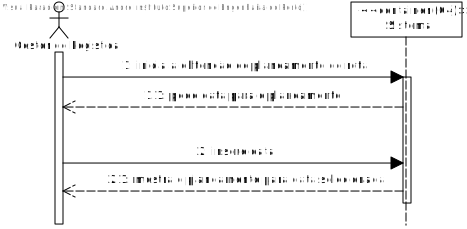
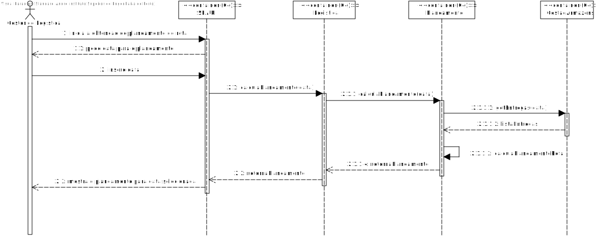
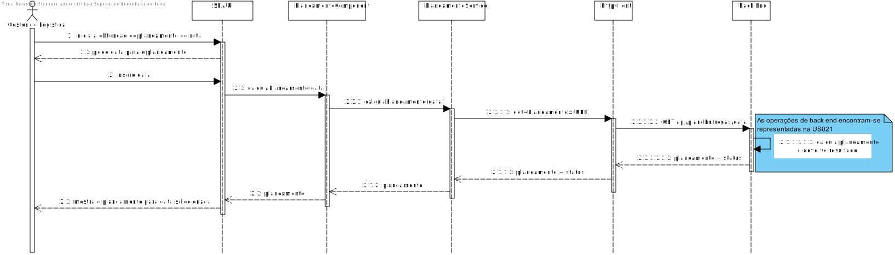

# US017 - Como gestor de logística pretendo obter o Planeamento da rota para 1 camião e 1 dado dia.

# 1. Análise

#### Requisitos funcionais

O sistema deve permitir ao gestor de logística obter o planeamento da rota para 1 camião para 1 dia.

#### Regras de negócio

* O gestor de logística deve poder escolher qual a heurística a utilizar para o cálculo do planeamento.

#### Partes interessadas

A parte interessada nesta US é o gestor de logística que obter o planeamento de rota para 1 dado dia.

#### Pré-condições

* Tem de existir no back end maneira de calcular o planeamento e retorna-lo.

#### Pós-condições

* Nenhuma.

#### Fluxo

O gestor de logística inicia a obtenção do planeamento de rota. O sistema pede a data pretendida. O gestor de logística insere a data. O sistema mostra o planeamento para a data selecionada.

## Nível 1 - Vista Processo:

# 2. Design

## Nível 2 - Vista Processo:

##  Padrões Aplicados

* Padrão GRASP (General Responsibility Assignment Software Patterns), utilizado na criação de controladores para atribuir a responsabilidade de manipular eventos do sistema para uma classe que não seja de interface do usuário (UI);

* Padrão CRUD (acrónimo do inglês Create, Read, Update and Delete) são as quatro operações básicas utilizadas em bases de dados relacionais fornecidas aos utilizadores do sistema, assim como em muitos serviços HTTP.

* Padrão SOLID (acrónimo do inglês Single Responsibility Principle, Open-Closed Principle, Liskov Substitution Principle, Interface Segregation Principle, Dependency Inversion Principle), princípios que se aplicam a qualquer design orientado a objetos, são a filosofia central para metodologias como desenvolvimento software adaptável.

* Padrão DTO (Data Transfer Objects), na criação de estruturas de dados simples que não contêm lógica de negócios.

* Padrão Mapper (Data Transfer Object Design Pattern), é um dos padrões de arquitetura de aplicativos corporativos que exige o uso de objetos que agregam e encapsulam dados para transferência. Um Objeto de Transferência de Dados é, essencialmente, como uma estrutura de dados. Ele não deve conter nenhuma lógica de negócios, mas deve conter mecanismos de serialização e desserialização.

* Padrão Repository, para fornecer melhor capacidade de manutenção e desacoplando à infraestrutura ou tecnologia usada para aceder à base de dados ou à camada de modelo de domínio.

* Padrão SPA, utilizado na User Interface para uma resposta rápida e fluída nas interações com o utilizador em que as HTTP responses são mais pequenas porque apenas "data" é mandada e deixa de ser necessário renderizar uma nova página a cada server request, havendo apenas um update parcial da página inicial.

# Implementação

# Observações

Esta US apenas representa o front end. O back end é tratado pela US021.
