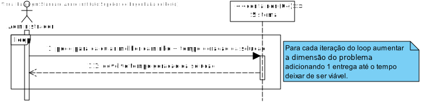
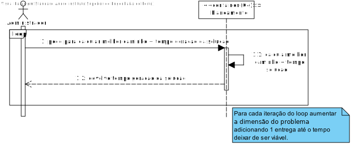

# US024 - Aumentar a dimensão do problema e verificar até que dimensão é viável proceder do modo adotado.

# 1. Análise

#### Requisitos funcionais

O sistema deve permitir ao administrador aumentar a dimensão do problema (adicionando mais entregas para armazéns diferentes) para descobrir até que dimensão é viável proceder calculando todas as soluções.

#### Regras de negócio

* Começar pelo número mínimo de entregas e adicionar uma a uma até este processo deixar de ser viável.

#### Partes interessadas

A parte interessada neste US é o administrador que pretende testar qual a melhor maneira de gerar as soluções para o problema das entregas tendo em quanta a dimensão do problema.

#### Pré-condições

* Nenhuma.

#### Pós-condições

* Nenhuma.

#### Fluxo

O administrador chama o predicado para descobrir o melhor caminho com 1 entrega. O sistema mostra o tempo da geração de solução. Repetir o processo adicionando uma entrega até o tempo de geração da solução deixar de ser viável.

## Nível 1 - Vista Processo:

# 2. Design

## Nível 2 - Vista Processo:

# Observações
É esperado que à medida que a complexidade aumenta, o tempo de geração de solução também aumento deixando a geração de todas as soluções ser uma alternativa viável e passando a ser necessário o uso de heurísticas.
