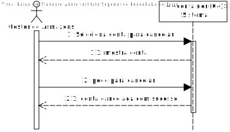

# US041 - Como administrador pretendo cancelar uma conta anonimizando os dados pessoais que tenham sido recolhidos

# 1. Análise

#### Requisitos funcionais

O sistema cancelar uma conta anonimizanda os dados pessoais do utilizador.

#### Regras de negócio

* Deve ser mantido um registo que a conta existiu.

#### Partes interessadas

A parte interessada nesta US é o administrador que pretende cancelar uma conta.

#### Pré-condições

* Tem de ser permitido criar contas.

#### Pós-condições

* O sistema tem de persistir o cancelamento na Base de Dados.

#### Fluxo

O administrador seleciona a conta para cancelar. O sistema mostra a conta. O administrador pede para a cancelar. O sistema cancela a conta.

## Nível 1 - Vista Processo:

# 2. Design

## Nível 2 - Vista Processo:

##  Padrões Aplicados

* Padrão GRASP (General Responsibility Assignment Software Patterns), utilizado na criação de controladores para atribuir a responsabilidade de manipular eventos do sistema para uma classe que não seja de interface do usuário (UI);

* Padrão CRUD (acrónimo do inglês Create, Read, Update and Delete) são as quatro operações básicas utilizadas em bases de dados relacionais fornecidas aos utilizadores do sistema, assim como em muitos serviços HTTP.

* Padrão SOLID (acrónimo do inglês Single Responsibility Principle, Open-Closed Principle, Liskov Substitution Principle, Interface Segregation Principle, Dependency Inversion Principle), princípios que se aplicam a qualquer design orientado a objetos, são a filosofia central para metodologias como desenvolvimento software adaptável.

* Padrão DTO (Data Transfer Objects), na criação de estruturas de dados simples que não contêm lógica de negócios.

* Padrão Mapper (Data Transfer Object Design Pattern), é um dos padrões de arquitetura de aplicativos corporativos que exige o uso de objetos que agregam e encapsulam dados para transferência. Um Objeto de Transferência de Dados é, essencialmente, como uma estrutura de dados. Ele não deve conter nenhuma lógica de negócios, mas deve conter mecanismos de serialização e desserialização.

* Padrão Repository, para fornecer melhor capacidade de manutenção e desacoplando à infraestrutura ou tecnologia usada para aceder à base de dados ou à camada de modelo de domínio.

* Padrão SPA, utilizado na User Interface para uma resposta rápida e fluída nas interações com o utilizador em que as HTTP responses são mais pequenas porque apenas "data" é mandada e deixa de ser necessário renderizar uma nova página a cada server request, havendo apenas um update parcial da página inicial.

# Implementação
## SPA

## Gestão Armazéns

# Observações
