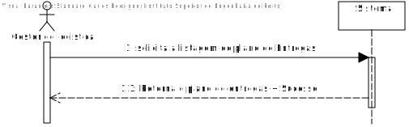
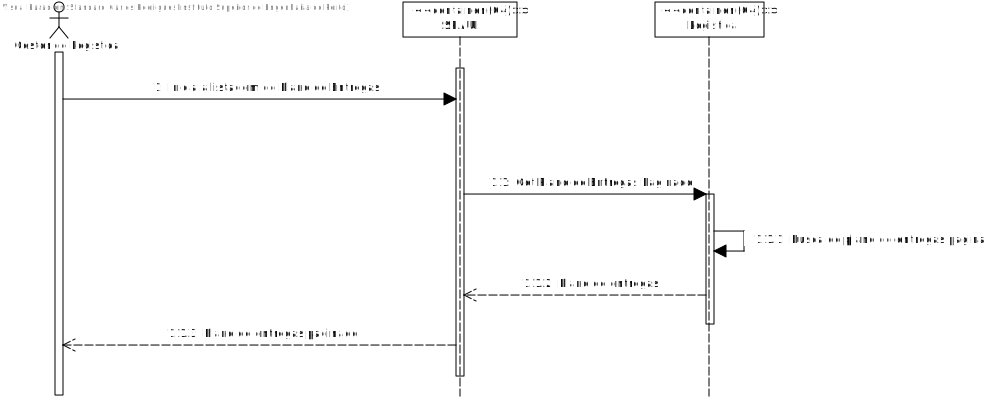
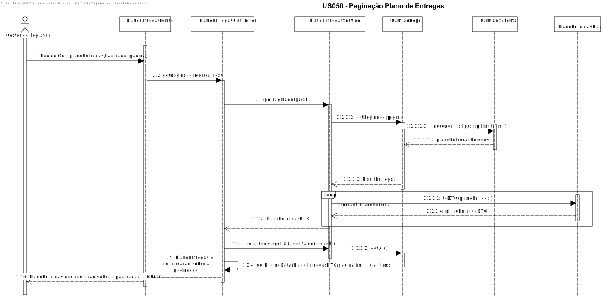

# US054 - Como gestor de logística pretendo listar as viagens por página.

# 1. Análise

#### Requisitos funcionais

O sistema deve permitir que o plano de Entregas seja listado por paginas.

#### Regras de negócio

* O administrador pretende visualizar a listagem do plano de entregas por paginas.
* Este pedido é feito por interface com o utilizador (Módulo SPA).
* O pedido é feito ao módulo SPA que comunica com o módulo de Logistica .

#### Partes interessadas

A parte interessada nesta US é o Gestor de Logistica.

#### Pré-condições

* Tem de existir plano de Entregas para a sua listagem.

#### Pós-condições

## Nível 1 - Vista Processo:

# 2. Design

## Nível 2 - Vista Processo:

##  Padrões Aplicados

* Padrão GRASP (General Responsibility Assignment Software Patterns), utilizado na criação de controladores para atribuir a responsabilidade de manipular eventos do sistema para uma classe que não seja de interface do usuário (UI);

* Padrão CRUD (acrónimo do inglês Create, Read, Update and Delete) são as quatro operações básicas utilizadas em bases de dados relacionais fornecidas aos utilizadores do sistema, assim como em muitos serviços HTTP.

* Padrão SOLID (acrónimo do inglês Single Responsibility Principle, Open-Closed Principle, Liskov Substitution Principle, Interface Segregation Principle, Dependency Inversion Principle), princípios que se aplicam a qualquer design orientado a objetos, são a filosofia central para metodologias como desenvolvimento software adaptável.

* Padrão DTO (Data Transfer Objects), na criação de estruturas de dados simples que não contêm lógica de negócios.

# Implementação

# Observações