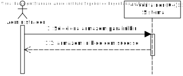
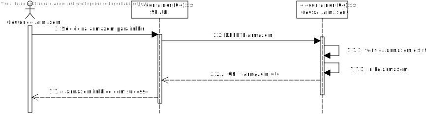
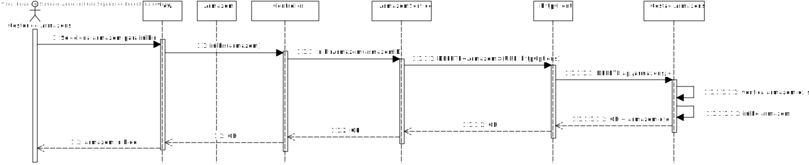
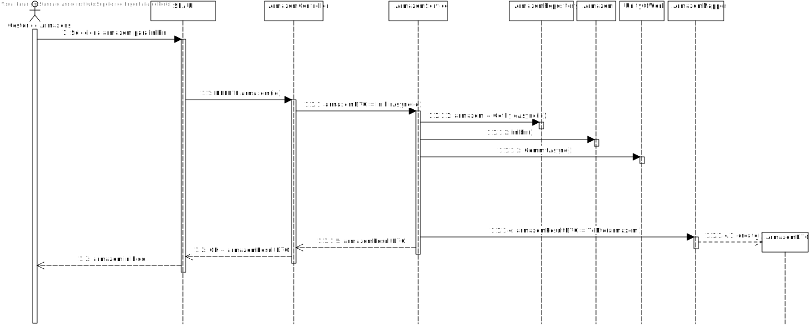

# US053 - Como gestor de armazéns, pretendo inibir um armazém

# 1. Análise

#### Requisitos funcionais

O sistema deve permitir ao gestor de armazém inibir um armazém.

#### Regras de negócio

* Não podem ser criadas entregas para armazéns inibidos.
* Na rede viária deve existir uma representação visual de que o armazém foi inibido.

#### Partes interessadas

A parte interessada nesta US é o gestor de armazém que pretende inibir um armazém.

#### Pré-condições

* Tem de existir armazéns no sistema.

#### Pós-condições

* O sistema tem de persistir a inibição do armazém na Base de Dados.

#### Fluxo

O gestor de armazém solicita a inibição de 1 armazém. O sistema inibe o armazém.

## Nível 1 - Vista Processo:

# 2. Design

## Nível 2 - Vista Processo:

##  Padrões Aplicados

* Padrão GRASP (General Responsibility Assignment Software Patterns), utilizado na criação de controladores para atribuir a responsabilidade de manipular eventos do sistema para uma classe que não seja de interface do usuário (UI);

* Padrão CRUD (acrónimo do inglês Create, Read, Update and Delete) são as quatro operações básicas utilizadas em bases de dados relacionais fornecidas aos utilizadores do sistema, assim como em muitos serviços HTTP.

* Padrão SOLID (acrónimo do inglês Single Responsibility Principle, Open-Closed Principle, Liskov Substitution Principle, Interface Segregation Principle, Dependency Inversion Principle), princípios que se aplicam a qualquer design orientado a objetos, são a filosofia central para metodologias como desenvolvimento software adaptável.

* Padrão DTO (Data Transfer Objects), na criação de estruturas de dados simples que não contêm lógica de negócios.

* Padrão Mapper (Data Transfer Object Design Pattern), é um dos padrões de arquitetura de aplicativos corporativos que exige o uso de objetos que agregam e encapsulam dados para transferência. Um Objeto de Transferência de Dados é, essencialmente, como uma estrutura de dados. Ele não deve conter nenhuma lógica de negócios, mas deve conter mecanismos de serialização e desserialização.

* Padrão Repository, para fornecer melhor capacidade de manutenção e desacoplando à infraestrutura ou tecnologia usada para aceder à base de dados ou à camada de modelo de domínio.

* Padrão SPA, utilizado na User Interface para uma resposta rápida e fluída nas interações com o utilizador em que as HTTP responses são mais pequenas porque apenas "data" é mandada e deixa de ser necessário renderizar uma nova página a cada server request, havendo apenas um update parcial da página inicial.

# Implementação
## SPA

## GA

# Observações
Implementação da inibicição dos armazéns na rede viária não foi implementada pois, na rede viária, os armazéns são estáticos. Foi, no entanto, colocado um exemplo da representação da inibicição dum armazém.
Caso os armazéns nao estivessem estáticos, seria feito um get dos armazéns inibidos, as coordenadas comparadas com os armazéns da rede, e os que correspondessem seriam inibidos.
