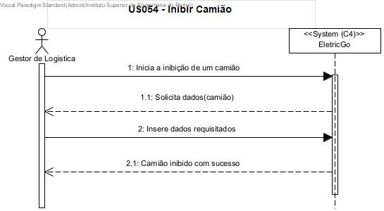

# US054 - Como gestor de Logistica pretendo inibir um camião.

# 1. Análise

#### Requisitos funcionais

O sistema deve permitir ao gestor de logistica iniba um camião.

#### Regras de negócio

* O gestor de logistica pretende inibir um  camião.
* Este pedido é feito por interface com o utilizador (Módulo SPA).
* O pedido é feito ao módulo SPA que comunica com o módulo de Logística .
* O camião tem de existir no sistema.

#### Partes interessadas

A parte interessada nesta US é o gestor de logistica.

#### Pré-condições

* O camião que se pretende inibir tem de existir no sistema.

#### Pós-condições

* Após a inibição do camião, o sistema tem de persistir a sua inibição na Base de dados.

## Nível 1 - Vista Processo:

# 2. Design

## Nível 2 - Vista Processo:

##  Padrões Aplicados

* Padrão GRASP (General Responsibility Assignment Software Patterns), utilizado na criação de controladores para atribuir a responsabilidade de manipular eventos do sistema para uma classe que não seja de interface do usuário (UI);

* Padrão CRUD (acrónimo do inglês Create, Read, Update and Delete) são as quatro operações básicas utilizadas em bases de dados relacionais fornecidas aos utilizadores do sistema, assim como em muitos serviços HTTP.

* Padrão SOLID (acrónimo do inglês Single Responsibility Principle, Open-Closed Principle, Liskov Substitution Principle, Interface Segregation Principle, Dependency Inversion Principle), princípios que se aplicam a qualquer design orientado a objetos, são a filosofia central para metodologias como desenvolvimento software adaptável.

* Padrão DTO (Data Transfer Objects), na criação de estruturas de dados simples que não contêm lógica de negócios.

# Implementação

# Observações