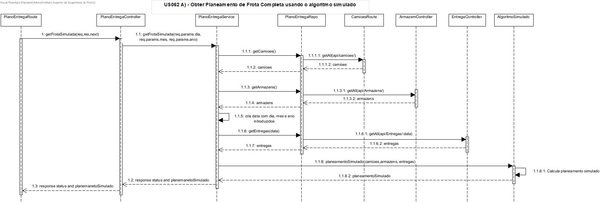

# US062 - Planeamento de frota: utilização de módulo de planeamento em Prolog e outro algoritmo simulado como estratégias distintas de planeamento

# 1. Análise

#### Requisitos funcionais

O sistema deve permitir ao gestor de logistica obter o planeamento de rota de toda a frota e o planeamento com a melhor solução segundo o algoritmo genético.

#### Regras de negócio

* O gestor de logistica pretende obter o planeamento e a melhor solução da frota completa para um dado dia.
* Este pedido é comunicado pelo SPA ao modulo Logistica, que faz todas as operações backEnd.
* O modulo Logistica gera o algoritmo simulado para o planeamento de toda a frota num dado dia e também comunica com o modulo Planeamento para este gerar a melhor solução do planeamento de frota.

#### Partes interessadas

A parte interessada nesta US é o gestor de logistica.

#### Pré-condições

#### Pós-condições

* Após inserir a data, deverá obter o planemaneto para consulta.

## Nível 1 - Vista Processo:

# 2. Design

## Nível 2 - Vista Processo:

##  Padrões Aplicados

* Padrão GRASP (General Responsibility Assignment Software Patterns), utilizado na criação de controladores para atribuir a responsabilidade de manipular eventos do sistema para uma classe que não seja de interface do usuário (UI);

* Padrão CRUD (acrónimo do inglês Create, Read, Update and Delete) são as quatro operações básicas utilizadas em bases de dados relacionais fornecidas aos utilizadores do sistema, assim como em muitos serviços HTTP.

* Padrão SOLID (acrónimo do inglês Single Responsibility Principle, Open-Closed Principle, Liskov Substitution Principle, Interface Segregation Principle, Dependency Inversion Principle), princípios que se aplicam a qualquer design orientado a objetos, são a filosofia central para metodologias como desenvolvimento software adaptável.

* Padrão DTO (Data Transfer Objects), na criação de estruturas de dados simples que não contêm lógica de negócios.

# Implementação

# Observações